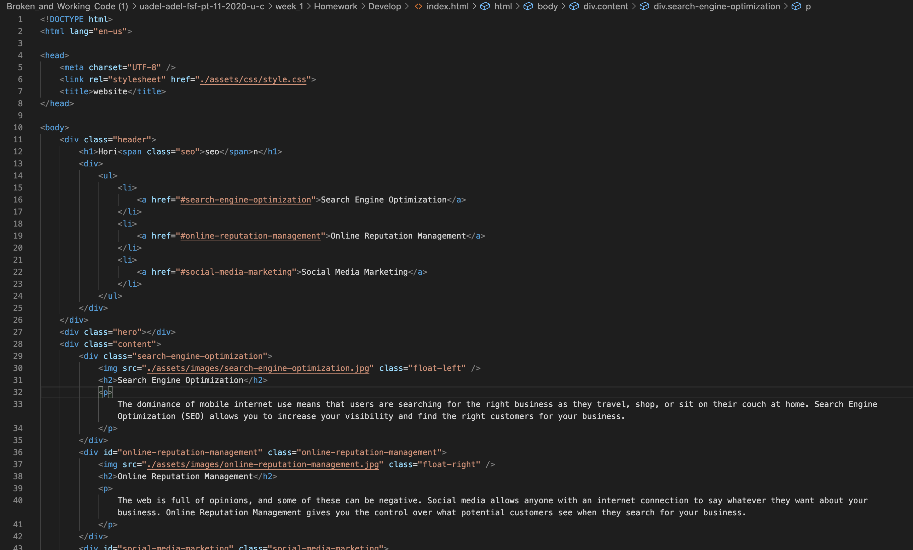
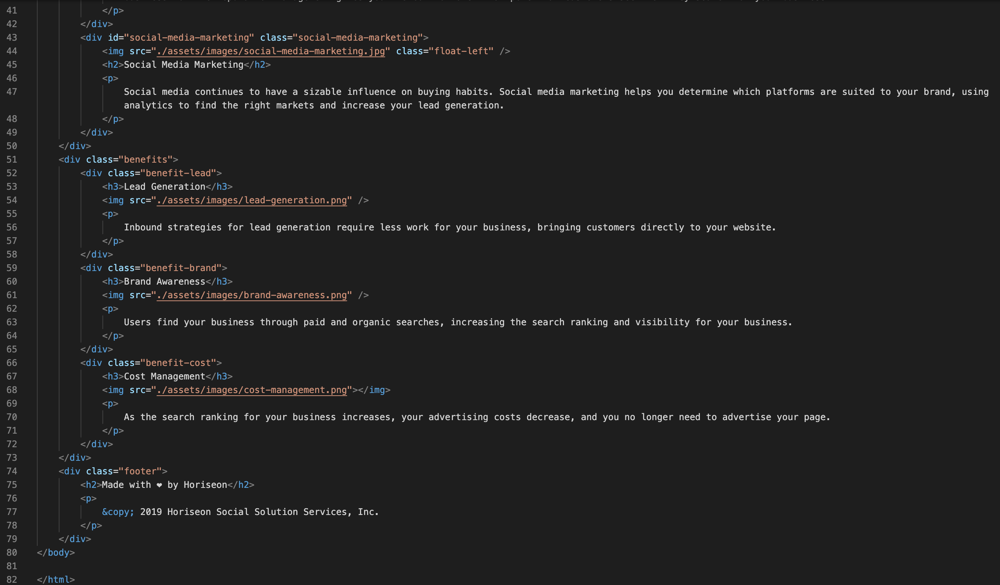
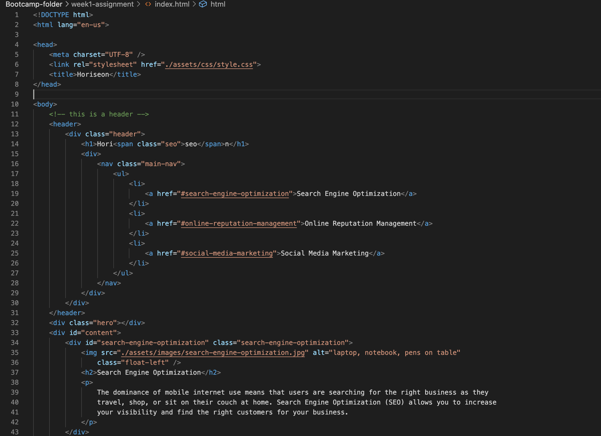
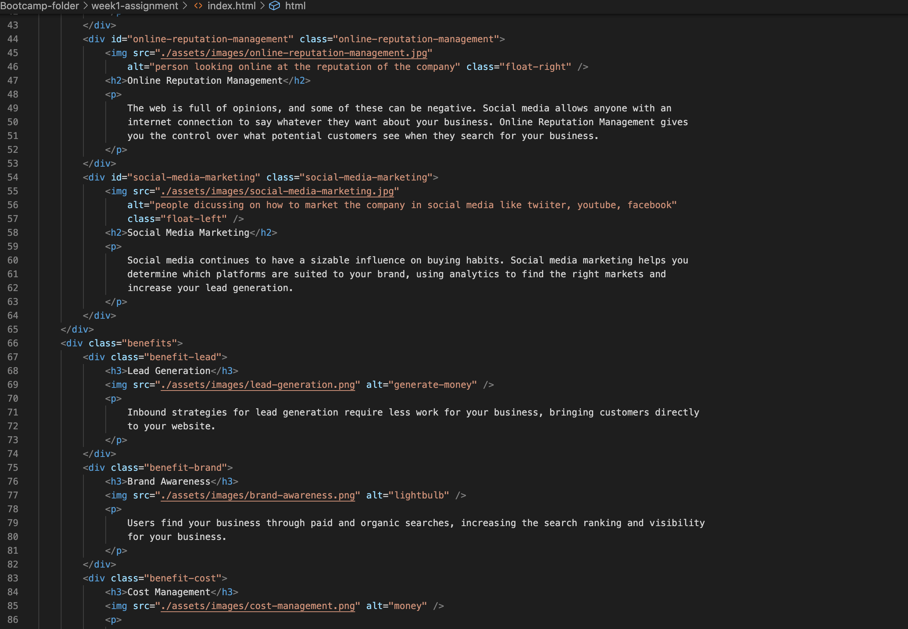
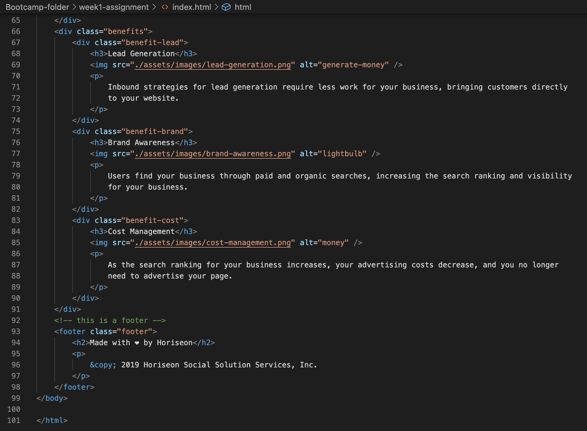

**Code Refactoring - The user-friendly website**

>This is a code refactoring assignment. The reason for doing this is to make sure that this website is working properly and is accessible especially to those who have special needs.
---
- Added the title of the website in the title
- Changed header class to header
- Changed div to nav
- Changed div to footer
- Added alt tags to images  
- Added the div id to the class of search engine optimisation as the link is not working properly
---
Change in the CSS
- content and benefit was changed from class(.) to id (#)

---
   >Below are the images of the original codes and the the changes that I've made in the code.

   - screenshots of original code
   
   
   
   - screenshots of the changes
   
   
   
